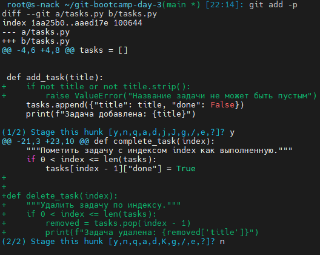
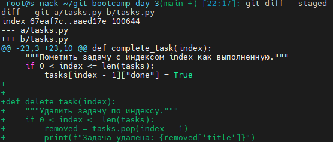
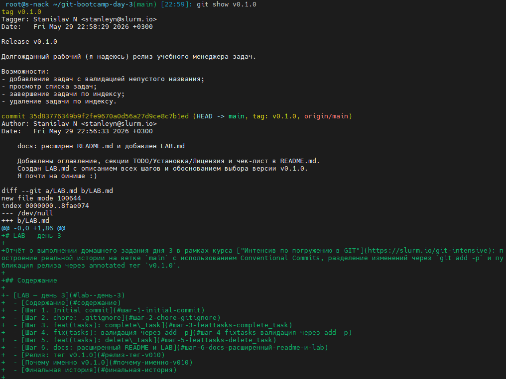
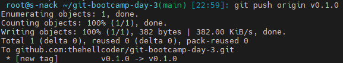
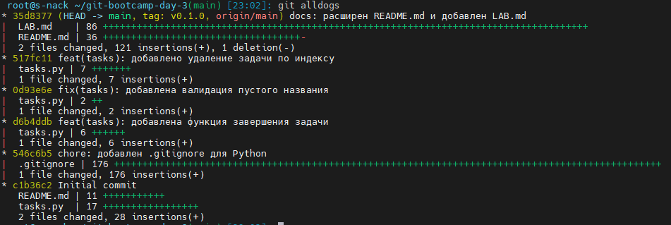

# LAB — день 3

Отчёт о выполнении домашнего задания дня 3 в рамках курса ["Интенсив по погружению в GIT"](https://slurm.io/git-intensive): построение реальной истории на ветке `main` с использованием Conventional Commits, разделение изменений через `git add -p` и публикация релиза через annotated тег `v0.1.0`.

## Содержание

- [LAB — день 3](#lab--день-3)
  - [Содержание](#содержание)
  - [Шаг 1. Initial commit](#шаг-1-initial-commit)
  - [Шаг 2. chore: .gitignore](#шаг-2-chore-gitignore)
  - [Шаг 3. feat(tasks): complete\_task](#шаг-3-feattasks-complete_task)
  - [Шаг 4. fix(tasks): валидация через add -p](#шаг-4-fixtasks-валидация-через-add--p)
  - [Шаг 5. feat(tasks): delete\_task](#шаг-5-feattasks-delete_task)
  - [Шаг 6. docs: расширенный README и LAB](#шаг-6-docs-расширенный-readme-и-lab)
  - [Релиз: тег v0.1.0](#релиз-тег-v010)
  - [Почему именно v0.1.0](#почему-именно-v010)
  - [Финальная история](#финальная-история)

## Шаг 1. Initial commit

В `Initial commit` находятся 2 файла-примера от лектора, скопированы без изменений.
Сообщение в коммите не соответствует Conventional Commits, т.к. для корневого это допустимо.

## Шаг 2. chore: .gitignore

Файлик-образец скачан с toptal для стека `Python`.

## Шаг 3. feat(tasks): complete_task

В модуль `tasks.py`(это scope) добавлена новая фича(это тип по CC) - функция для пометки задач выполненными.

## Шаг 4. fix(tasks): валидация через add -p

Были 2 изменения в разных частях `tasks.py`, но благодаря функционалу `git add -p` в коммит попало только верхнее - проверка названия задачи на "пустоту". Удобненько, не знал.

Скриншот интерактивной сессии `git add -p`:



## Шаг 5. feat(tasks): delete_task

Закоммитил оставшийся кусочек - удаление задачи по индексу. Перед коммитом проверил, какие изменения попали в индекс.

Скриншот `git diff --staged` перед коммитом:



## Шаг 6. docs: расширенный README и LAB

Дошли рученьки оформить ридмишку - добавил лицензию, пример установки, блок "на будущее", спойлер с предупреждением и оглавление. Поигрался с MarkDown, в общем.
NB: Сообщение к коммиту писать чреез редактор!!!

## Релиз: тег v0.1.0

После шага 6 запушил в `main` и  поставил annotated тег, запушив и его:

```bash
git push origin main
git tag -a v0.1.0      # многострочное сообщение через редактор
git push origin v0.1.0
```

Скриншот вывода `git show v0.1.0` (видно `tag` объект, автора, сообщение):



Скриншот публикации тега (`git push origin v0.1.0` или страница Releases/Tags на GitHub):



## Почему именно v0.1.0

- не уверен в стабильности API
- чтобы перейти на `v1.0.0`, мне нужен GUI и тесты
- а пока не могу гарантировать, что приложение будет работать (реально не проверял)

Выбрана annotated-версия тега, т.к. GitHub показывает в Releases только annotatedю
Надеюсь, будет ссылка на дату и сообщение релиза.

## Финальная история

Скриншот ниже сделан **сразу после `git push origin v0.1.0`**, до того как был добавлен этот же `LAB.md` со скриншотами. На нём видно 6 коммитов; на последнем — `HEAD -> main, tag: v0.1.0` (тег и HEAD на одном коммите):



После того как я закоммитил актуализацию `LAB.md` со ссылками на скрины 1/4/5, в репозитории появился 7-й коммит. Теперь `HEAD -> main` указывает на него, а тег `v0.1.0` остался на 6-м коммите — на том же, где и был в момент релиза. Тег не двигается за веткой — это и есть его свойство, которое отличает его от ветки.

```bash
git rev-parse v0.1.0 = 219927c97ecdca144d639dc5f4c972dcf041cd08

git rev-parse HEAD = 35d83776349b9f2fe9670a0d56a27d9ce8c7b1ed
```
